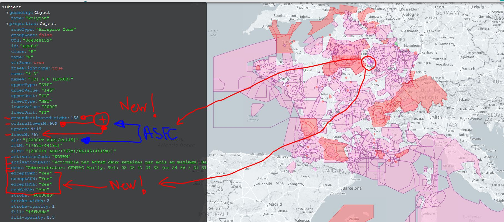

# aixmParser

*/!\ ATTENTION: Seules des données officielles doivent êtres utilisées pour la navigation aérienne.*  
*/!\ WARNING  : Only official data must be used for air navigation*  

Programme d'extraction et de formatage des données issues du standard AIXM (Aeronautical Information Exchange Modele)  
Les fichiers actuellements générées sont les suivants:  
```
a/ Catalogue des zones aériennes, disponible sous deux formats:  
	- airspacesCatalog.json  
	- airspacesCatalog.csv  

b/ Description des zones aériennes, disponibles selon deux formats : GeoJSON (file.geojson) et Openair (file.txt)
	- airspaces-all             Cartographie complète de l'espace aérien (IFR + VFR)  
	- airspaces-ifr             Cartographie de l'espace aérien IFR (zones situées au dessus  du niveau FL115)  
	- airspaces-vfr             Cartographie de l'espace aérien VFR (zones situées en dessous le niveau FL115)  
	- airspaces-freeflight      Cartographie de l'espace aérien dédié Vol-Libre (dessous FL115 +filtre +compl.)  
	Nota. Ces fichiers seront bientôts disponibles au format GoogleEarth (file.kml) 

c/ Description d'informations aéraunautique complémentaires, disponible au format GeoJSON(*):  
	- aerodromes.geojson  
	- towers.geojson  
	- gates-stands.geojson  
	- runwaysCenter.geojson  
	- obstacles.geojson  
	- borders.geojson  
	Nota. Le fichier borders est également disponible au format Openair '.txt')

(*) AIXM - Aeronautical Information Exchange Modele : Un standard internationanl d'échange de données aéronautiques. Basé sur la technologie XML - http://www.aixm.aero/   
Nota. Actuellement, seul l'ancien format AIXM 4.5 est pris en charge. Ultérieurement, ce programme évoluera pour prendre en charge la version AIXM 5.1  

(*) GeoJSON - Geographic JSON.  Un format ouvert d'encodage données géospatiales. Basé sur la technologie JSON (JavaScript Object Notation) et issu du projet OpenStreetMap, il est compatible avec le système : https://www.google.fr/maps  
Les données GeoJSON sont visualisables par des outils tels que : http://geojson.tools/   ou   http://geojson.io/  

(*) Openair - Open airspace and terrain description language - Un format ouvert d'encodage de données aéronautiques. Basé sur un format simplifié (TEXT file format) et utilisé par  de nombreux logiciels - http://www.winpilot.com/UsersGuide/UserAirspace.asp  
Les données Openair sont visualisables par des outils tels que : http://xcglobe.com/cloudapi/browser  -or-  http://cunimb.net/openair2map.php  

(*) GoogleEarth - Le globe terrestre en 3D le plus détaillé au monde - Un format d'encodage données géospatiales. Basé sur la technologie XML - https://www.google.com/earth/  
```

## Installation
```
pip install -r requirements.txt
```

## Utilisation

Selon le choix des options de génération; le programme produira un log et les fichiers dans le dossier ./out/  
Les options d'utilisations s'auto décrivent avec l'aide en ligne "aixmParser -h":  
```
aixmParser v2.7.0  
-----------------  
Aeronautical Information Exchange Model (AIXM) Converter  
Call: aixmParser <[drive:][path]filename> <Format> <Type> [<Type2> ... <TypeN>] [<Option(s)>]  
With:  
  <[drive:][path]filename>       AIXM source file  

  <Format> - Output formats:  
    -Fgeojson        GeoJSON for GoogleMap  
    -Fkml            KML for GoogleEatrh  
    -Fopenair        OpenAir for aeronautical software  
    -Fall            All output formats (simultaneously)  

  <Type(s)> - Data to export:  
    -Airspaces  
    -GeoBorders  
    -Obstacles  
    -Aerodromes  
    -RunwayCenter  
    -ControlTowers  
    -GateStands  
    -Tall           All exported type (simultaneously)  

  <Option(s)> - Complementary Options:  
    -h              Help syntax  
    -CleanLog       Clean log file before exec  
    -Silent         Silent mode (no log-file, no system-message, but log-report is available ;-)  
    -IFR            Specific upper vues of aeronautic maps (IFR areas)  
    -VFR            Specific lower vues of aeronautic maps (only IFR areas, without IFR areas)  
    -FreeFlight     Specific Paragliding/Hanggliding maps (out E,F,G,W areas and others...)  
    -Draft          Size limitation for geojson output  

  Samples: aixmParser ../tst/aixm4.5_SIA-FR_2019-12-05.xml -Fall -Tall -CleanLog  
           aixmParser ../tst/aixm4.5_SIA-FR_2019-12-05.xml -Fgeojson -Airspaces -Obstacles -ControlTowers -CleanLog  
           aixmParser ../tst/aixm4.5_SIA-FR_2019-12-05.xml -Fall -Airspaces -FreeFlight -CleanLog  

  Resources  
     GeoJSON test format: http://geojson.tools/  -or-  http://geojson.io  
     OpenAir test format: http://xcglobe.com/cloudapi/browser  -or-  http://cunimb.net/openair2map.php  
```


## Output samples




## Credits
- [Cristian Quest](https://github.com/cquest) for the first version of parser aixm2geojson
- [Pascal Bazile](https://github.com/BPascal-91/) for complete modular rewriting of aixmPaser. For integration of: OpenAir parser and Referential estimated height of grounds
- the many open source libraries, projects, and data sources used by this software (show file content of 'requirements.txt' for complete components detail)
